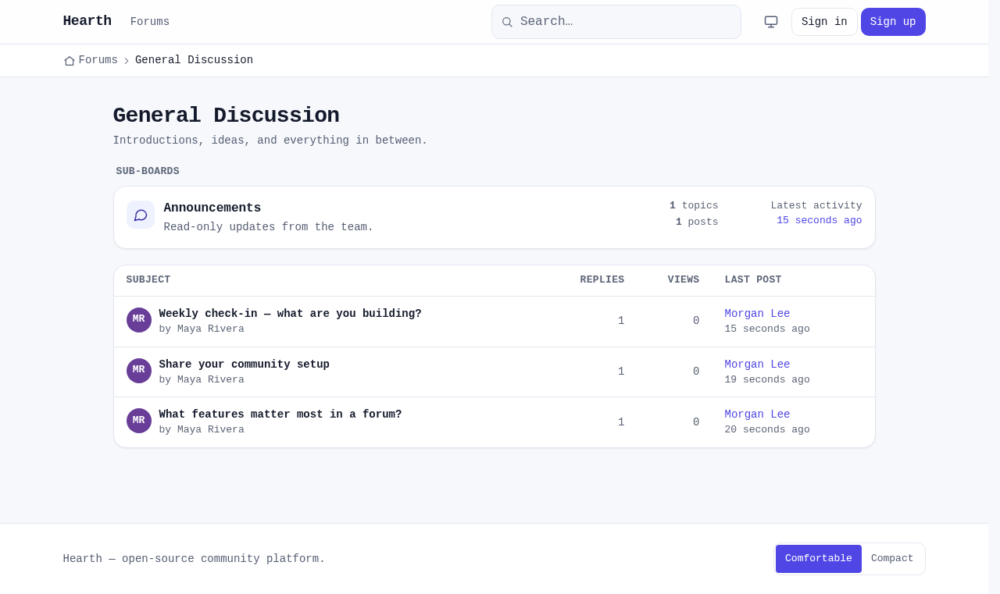
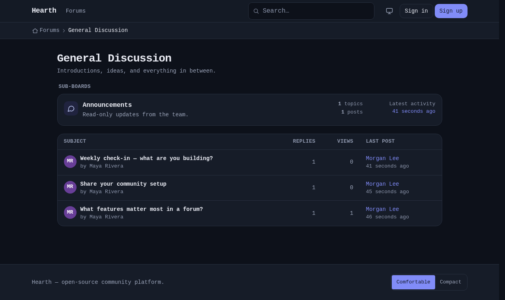
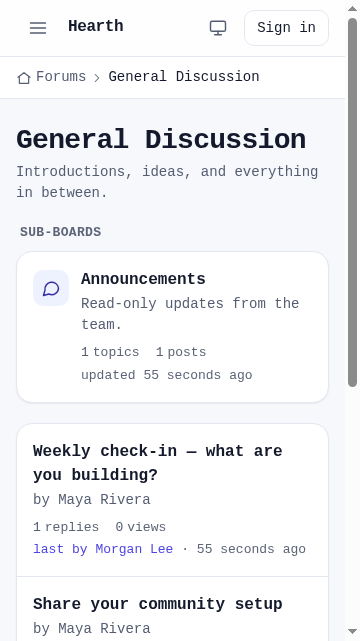
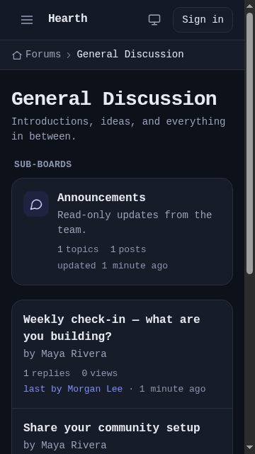

<!--
SPDX-License-Identifier: Apache-2.0
Copyright 2026 The NovFora Authors
-->
# Default theme — screenshot gate

Captured by the Dusk harness (`tests/Browser/ThemeScreenshotTest.php`) — the core pages in **light + dark**
at **mobile (360px)** and **desktop (1280px)**. Regenerate with
`docker compose -f docker/dusk/compose.yml run --rm dusk` (PASS 2 writes these) or the CI **dusk** job
(uploaded as the `dusk-screenshots` artifact).

> **Refreshed for polish round 1** ([theme-polish-round-1.md](../theme-polish-round-1.md)): the **board view**
> is now an info-dense topic table with a sub-boards block, the **topic view** has a classic left poster
> sidebar, the index rows carry last-post info, and breadcrumbs are a prominent nav-tree bar.

> **Font note:** these are rendered by headless Chromium in a minimal Debian image, so `system-ui` falls back
> to the container's default face (it looks slightly monospaced). On a real OS the theme renders in the native
> UI font (Segoe UI / San Francisco / Roboto). Judge layout, spacing, colour, and contrast here — not the font.

## Board view — topic table + sub-boards (round 1)
| | Light | Dark |
|---|---|---|
| Desktop |  |  |
| Mobile (360) |  |  |

## Topic view — left poster sidebar (round 1)
| | Light | Dark |
|---|---|---|
| Desktop |  |  |
| Mobile (360) |  |  |

## Forum index — with last-post (round 1)
| | Light | Dark |
|---|---|---|
| Desktop |  |  |
| Mobile (360) |  |  |

## Auth (sign in)
| | Light | Dark |
|---|---|---|
| Desktop |  |  |
| Mobile (360) |  |  |

## Settings — appearance
| | Light | Dark |
|---|---|---|
| Desktop |  |  |
| Mobile (360) |  |  |
